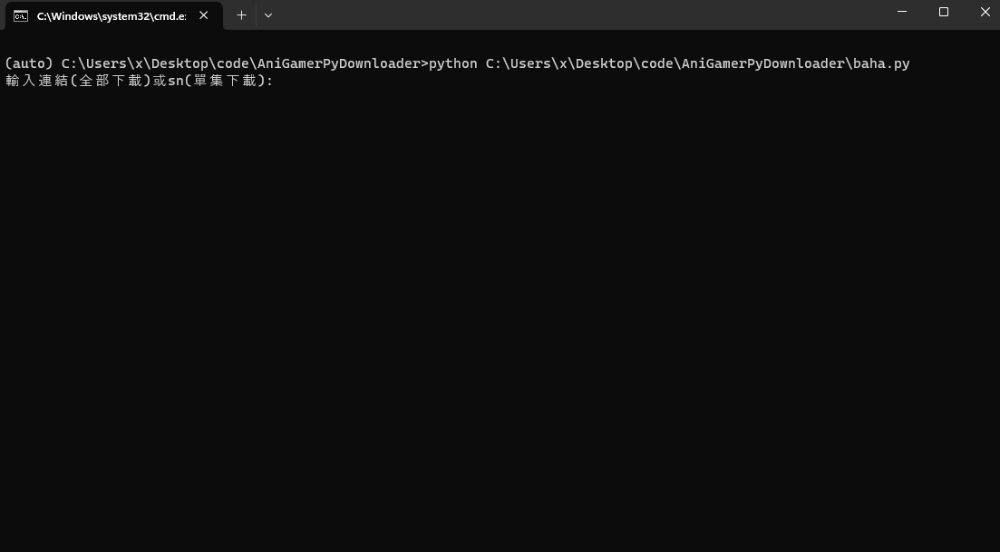

# 簡介

巴哈姆特動畫瘋下載工具

## 安裝方法

需要下載 [FFmpeg解碼器](https://ffmpeg.zeranoe.com/builds/) 放置到主程式同一資料夾裡 

需要建立python環境，安裝套件 **pip install -r requirements.txt**

  

## 使用方法

1. 需要先在Google Chrome登入動畫瘋  (運行時會自動取得Google Chrome的Cookies)
2. 打開config.txt，設定下載路徑和下載畫質
3. 指令執行**'python baha.py'**或是修改**'run.bat'**檔內的環境位置後執行

輸入sn碼可下載單集

輸入影片完整網址可選擇下載系列

## 參考

 [sakuraakira/AniGamerDownloader](https://github.com/sakuraakira/AniGamerDownloader/)
